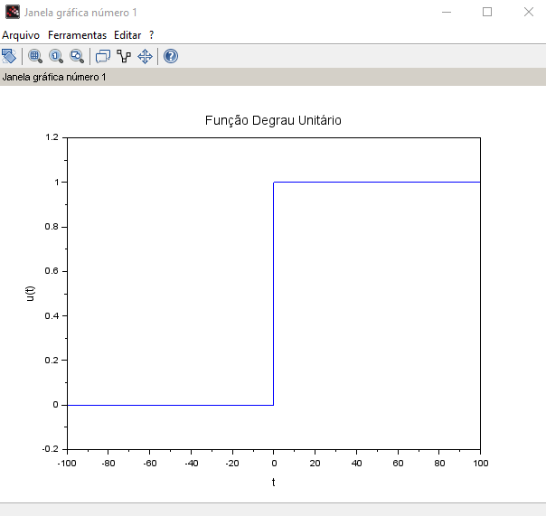

# An-lise-de-Sinais-e-Sistemas
clc
clear

// A função em questão é definita por u(t - a) e dada por:
function [degrau] = u(tempo)
    if tempo >= 0 then
        degrau = 1;
    else
        degrau = 0;
    end
endfunction
// O degrau unitário assumirá valores diferente de zero quando o tempo for
// maior que zero, pois com isso, já é o suficiente para estudo da 
// Transformada de Laplace.

// O gráfico da função degrau unitário pode ser visualizado dessa forma:
t = -100:0.01:100; // incrementação do tempo de -100 até 100
f1 = scf(1);
clf(f1);
plot(t,u); // plotagem
xlabel("t");ylabel("u(t)"); // nomes para eixos
mtlb_axis([-100 100 -0.1 1.1]);
title('Função Degrau Unitário');

