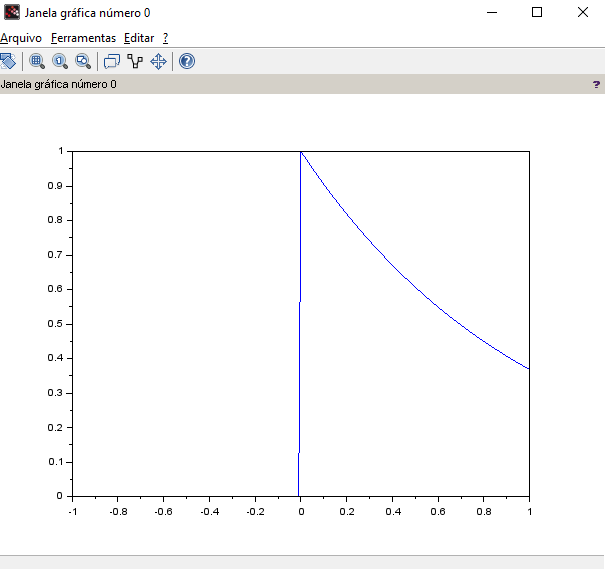
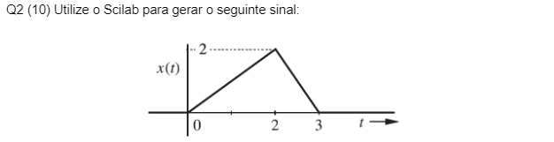

# Análise de Sinais e Sistemas
// IFPB - Cajazeiras
// Engenharia de Controle e Automação 4º período
// Análise de Sinais e Sistemas
// Renan Saraiva dos Santos


## Função Unitário
// A função em questão é definita por u(t - a) e dada por:

// O degrau unitário assumirá valores diferente de zero quando o tempo for
// maior que zero, pois com isso, já é o suficiente para estudo da 
// Transformada de Laplace.
// O gráfico da função degrau unitário pode ser visualizado dessa forma:


## Sinal do tipo Rampa

// Definição para Sinal do tipo Rampa:
// "um sinal em rampa, x(t) = t, aumenta indefinidamente quando |t|→∞ e nem a energia nem a potência existirão para este sinal"


// definição de intervalo
t = -6:0.01:6;

// desenvolvimento do sinal rampa
// a estruturação de tal sinal contêm um degrau do tipo:
// para t >= 0 temos r3=(-t+3)
// e que, por definição da função degrau, temos u(t) = 0, para t < 0
r3 = (-t+3).*(t>=2).*(t<=3);
// para valores de t = 0 até 2 temos u(t) = 1


## Exponencial Decrescente



## Desenvolva implementação computacional



### CONDIÇÕES:
```
elseif tMod > 0 && tMod <=2 then
        // p1 (0, 0) p2 (2, 2) y = mx + b
        // 0 = 0m + b => b = 0
        // 2 = 2m + b => x = 1
        // então, temos: y = m 
elseif tMod > 2 && tMod <= 3 then
        // p2 (2, 2) p3 (3, 0) y = mx + b
        // 0 = 3m + b = 0 = 3m + 2 - 2m => m = -2
        // 2 = 2m + b = b = 2 - 2m     
        // 2 = 2(-2) + b = 2 + 4 = 6
```
